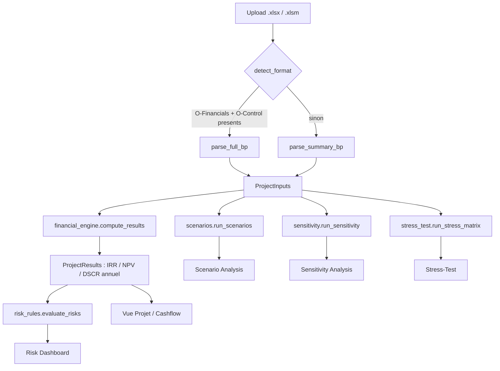

# Bankability_Project — Outil de bancabilite BESS

Application Streamlit qui lit le Business Plan Excel d'un projet de stockage batterie (BESS)
et restitue les analyses de bancabilite standard attendues par les preteurs. Suit la structure
en six couches decrite dans l'article de reference
[« How we built a BESS bankability template »](https://tudorionutgrigore.substack.com/p/how-we-built-a-bess-bankability-template)
(Tudor Ionut Grigore) : revenue stack modelling, degradation/availability, bear case stress
testing, sensitivity architecture, risk assessment layer, dashboard layer.

## Installation

Toujours depuis `bankability_app/` (pas la racine du repo) :

```bash
py -m venv .venv
.venv\Scripts\python.exe -m pip install -r requirements.txt
.venv\Scripts\python.exe -m pip install pytest pytest-cov ruff black   # outils dev/test, optionnels pour juste lancer l'app
```

## Commandes

**Sans activer le venv** (fonctionne toujours, y compris si PowerShell bloque les scripts
`.ps1` non signes — erreur "l'execution de scripts est desactivee sur ce systeme") : prefixer
chaque commande par `.venv\Scripts\python.exe -m`.

```bash
.venv\Scripts\python.exe -m streamlit run app.py
.venv\Scripts\python.exe -m pytest tests/ -q
.venv\Scripts\python.exe -m ruff check core/ ui/ tests/ app.py --fix
.venv\Scripts\python.exe -m black --line-length 100 core/ ui/ tests/ app.py
.venv\Scripts\python.exe sample_data/build_sample_xlsx.py
```

**En activant le venv** (invite de commande prefixee par `(.venv)`, commandes plus courtes
ensuite) — necessite que l'execution de scripts PowerShell soit autorisee :

```powershell
# Une seule fois par utilisateur, si l'activation echoue avec une erreur de execution policy
Set-ExecutionPolicy -ExecutionPolicy RemoteSigned -Scope CurrentUser

.venv\Scripts\activate       # PowerShell/cmd, Windows
source .venv/bin/activate    # macOS / Linux

streamlit run app.py
pytest tests/ -q
ruff check core/ ui/ tests/ app.py --fix
black --line-length 100 core/ ui/ tests/ app.py
python sample_data/build_sample_xlsx.py
```

Sans activer le venv, prefixer chaque commande par le chemin de son python
(`.venv\Scripts\python.exe -m streamlit run app.py` sur Windows).

## Methodologie et provenance des donnees dans le BP

L'app supporte deux formats de classeur Excel, detectes automatiquement
(`bp_parser.detect_format`) :

- **Format resume** — un seul onglet, cashflows deja agreges par annee. Mapping :
  `config/bp_mapping.yaml`. Illustre par `sample_data/260612_BP_Stockage_Standalone__Claude.xlsx`.
- **Format complet** — classeur reel multi-onglets, reconnu a la presence des onglets
  `O-Financials` (P&L + cashflows annuels) et `O-Control` (hypotheses + resultats deja calcules).
  Mapping : `config/bp_mapping_full.yaml`.

Dans les deux cas, le parsing se fait **par recherche de libelle** dans la grille de cellules
(pas par adresse de cellule fixe) — voir `docs/specs/bp_parsing.md` pour le detail de cette
decision. Ci-dessous, pour chacune des six couches de l'article, ce que l'app implemente et
**precisement d'ou vient chaque donnee dans le BP**.

### 1. Revenue Stack Modelling

Article : *"DAM/ID arbitrage, ancillary services (FCR, aFRR, mFRR), capacity payments, balancing
market participation"*, plus les overlays contractuels (CfD, tolling, PPA avec floor).

Implemente : le total des revenus annuels, utilise tel quel par le moteur financier.

| Donnee | Format resume | Format complet |
|---|---|---|
| Revenus annuels (total) | ligne `Revenues` (onglet unique) | ligne `Revenues` de `O-Financials` |
| Detail PPA / Merchant / Capacite | non disponible | sous-lignes `PPA Revenues`, `Merchant revenues (net of energy costs)`, `Capacity market` de `O-Financials` (non extraites individuellement pour l'instant) |
| Detail par flux (DA, ID, aFRR, FCR isoles) | non disponible | **non implemente** — existe dans l'onglet `Annual cashflows 1 MW` (lignes `wholesale_storage_*`, `intraday_revenue`, `afrr_*`, `fcr_revenue`), mais la cle `configuration` a utiliser pour un projet donne (fonction de `Type TURPE` + duree + segment, definis dans `I-Project`) n'est pas encore fiabilisee — voir `docs/specs/bp_parsing.md`, "Questions ouvertes" |

### 2. Degradation and Availability

Article : courbes de fade de capacite calibrees sur la chimie/cyclage (pas les specs
constructeur), cas base et conservative, disponibilite liee aux termes du contrat O&M.

Implemente : `core/degradation.py` — une courbe de degradation **additionnelle**, appliquee
par-dessus la serie de revenus du BP (qui encode deja implicitement sa propre hypothese de
degradation/baisse de prix). **Pas extraite du BP** : valeurs par defaut (Base -2%/-0.5% par an,
Conservative -3%/-1% par an), editables dans `config/` ou en argument de
`degradation_multipliers()`. La disponibilite liee au contrat O&M n'est pas modelisee.

### 3. Bear Case Stress Testing

Article : matrice testant le bear case revenu, la degradation, et le combine, pour reperer les
points de rupture du modele.

Implemente : `core/stress_test.py` — grille `{Base, Bear} x {degradation Base, Conservative}`
(4 cellules), chacune recalculee via `financial_engine.compute_results`. Le "Bear" applique un
multiplicateur de -15% sur les revenus extraits du BP (voir couche 1) ; la degradation est celle
de la couche 2 (non extraite du BP).

### 4. Sensitivity Architecture

Article : *"20 to 30 pre-built scenarios"* sur les variables que les preteurs challengent :
compression du capture rate, changements reglementaires, depassements de CAPEX, chocs de taux,
curtailment reseau.

Implemente : `core/sensitivity.py` — 5 variables x 5 chocs (±10%/±20%) = 25 scenarios : Revenue
Total, CAPEX, OPEX, Interest Rate, Debt Ratio. CAPEX/OPEX/Revenue viennent des series du BP
(couche 1 et CAPEX/OPEX, voir tableau ci-dessous) ; Interest Rate et Debt Ratio partent des
hypotheses de financement (voir couche 5bis). Les variables de marche isolees (DAM Spread, ID
Spread, Cycles, Capacity Price) listees par l'article ne sont pas encore actives, meme
limitation que le detail par flux de la couche 1.

| Donnee | Format resume | Format complet |
|---|---|---|
| CAPEX (total) | ligne `CAPEX` (onglet unique) | ligne `CAPEX (w/o DSRA and financing fees)` de `O-Financials` |
| OPEX (total) | ligne `OPEX (live = C-SPV)` | ligne `Operating Costs` de `O-Financials` |
| TURPE / taxes d'exploitation | ligne `TURPE (variable + fixe)` | ligne `Operating Taxes` de `O-Financials` (regroupe TURPE + IFER/TFPB/CFE/CVAE) |

### 5. Risk Assessment Layer

Article : *"Embedded commentary inside the model, triggering when certain median/minimum
thresholds are not met"*, avec severite, envoye a la couche Dashboard.

Implemente : `core/risk_rules.py` + `config/risk_thresholds.yaml` — 3 regles (DSCR min, Equity
IRR vs hurdle rate, Project IRR vs WACC), chacune produisant un flag rouge/orange/vert. **Seuils
non extraits du BP** (config app : DSCR 1.30x/1.10x, hurdle 8%) ; les metriques evaluees (DSCR,
IRR) sont, elles, calculees par `financial_engine.py` a partir des donnees BP (couches 1 et 5bis).

**5bis. Hypotheses de financement** (non nommee explicitement dans l'article, mais necessaire
pour DSCR/Equity IRR) :

| Donnee | Format resume | Format complet |
|---|---|---|
| Gearing (% dette) | non disponible (defaut UI 70%) | 2e valeur non-vide apres le libelle `Debt` de `O-Control` |
| Taux d'interet | non disponible (defaut UI 5%) | libelle `All-in rate (fixed part)` de `O-Control` |
| Maturite de la dette | non disponible (defaut UI 15 ans) | libelle `Maturity` de `O-Control` |
| WACC | libelle `WACC` (onglet unique, si present) | absent du BP — approxime par un blend `gearing x taux dette + (1-gearing) x "Equity discount factor"` (voir `docs/specs/bp_parsing.md`) |

### 6. Dashboard Layer

Implemente : les six onglets Streamlit (`app.py` + `ui/*.py`) — Vue Projet, Cashflow, Scenario
Analysis, Sensitivity Analysis, Stress-Test, Risk Dashboard — chacun affichant les flags/valeurs
produits par les couches precedentes, avec pour chaque metrique cle la valeur recalculee **et**
la valeur deja presente dans le BP source quand elle existe (`ProjectInputs.reported_*`), pour
comparaison directe plutot que remplacement silencieux.

### Hypotheses techniques / projet (hors 6 couches)

| Donnee | Format resume | Format complet |
|---|---|---|
| Nom du projet | libelle `Name` | libelle `Name` de `O-Control` |
| Localisation | libelle `Location city` | libelle `Location city` de `O-Control` |
| Segment tarifaire | libelle `Segment` | libelle `Segment` de `O-Control` |
| Date de mise en service (COD) | libelle `BESS commercial operation date (COD)` | idem, dans `O-Control` |
| Duree d'exploitation | libelle `BESS operating time` | idem, dans `O-Control` |
| Puissance utile | libelle `BESS Usable Power` | libelle `ESS Usable Power @PoC (AC)` de `O-Control` |
| Energie utile | libelle `BESS Usable Energy` | libelle `ESS Usable Energy @PoC BoL (AC)` de `O-Control` |
| IRR / NPV / DSCR deja calcules dans le BP | libelles `IRR`, `WACC`, `NPV` | libelles `IRR` (+ 2e valeur = Equity IRR), `NPV`, `Average DSCR`, `Min. DSCR` de `O-Control` |

## Architecture



Modules (`core/`) :

| Module | Role | Couche(s) de la methodologie |
|---|---|---|
| `models.py` | Dataclasses pivot : `ProjectInputs`, `YearlyResult`, `ProjectResults` | — |
| `bp_parser.py` | Lecture Excel -> `ProjectInputs` (2 formats, detection automatique) | 1, 5bis, techniques |
| `financial_engine.py` | IRR / NPV / dette a gearing fixe / DSCR annuel | 1, 5bis |
| `degradation.py` | Courbes de degradation additionnelle (Base / Conservative) | 2 |
| `scenarios.py` | Scenarios Bear (P10) / Base (P50) / Bull (P90) | 3 (variante) |
| `sensitivity.py` | Sensibilite one-way (tornado) ±10%/±20% | 4 |
| `stress_test.py` | Matrice de stress combine (revenu x degradation) | 3 |
| `risk_rules.py` | Regles de seuils -> flags rouge/orange/vert | 5 |

Configuration (`config/`) :

- `bp_mapping.yaml` — mapping libelle -> emplacement pour le format resume (1 onglet)
- `bp_mapping_full.yaml` — mapping libelle -> emplacement pour le format complet
  (`O-Financials` + `O-Control`)
- `risk_thresholds.yaml` — seuils du dashboard de risques (DSCR, hurdle rate, marge WACC)

Chaque module ci-dessus a sa spec retrospective dans `docs/specs/` (objectif, decisions,
bugs corriges, questions ouvertes) — a lire avant de le modifier.

## Conventions de signe (a ne jamais casser)

Les series annuelles de `ProjectInputs` portent **leur propre signe**, tel qu'exporte par le BP
source :

- `revenues_keur`, `end_of_life_keur` : **positifs** (entrees de cash)
- `capex_keur`, `opex_keur`, `turpe_keur` : **negatifs** (sorties de cash)

Consequence directe : le CFADS est une **simple somme** (`revenue + opex + turpe + end_of_life`),
jamais une soustraction. Deux bugs de signe (CFADS et part CAPEX financee par l'equity) ont ete
introduits puis corriges pendant l'implementation initiale — voir `docs/specs/financial_engine.md`
pour le detail, et `tests/test_financial_engine.py` pour les regressions correspondantes.

Les champs scalaires "hypotheses" (ex. `capex_initial_keur`) sont en revanche des **magnitudes
positives** (valeurs d'info, pas des flux de cashflow) — ne pas les confondre avec les series.

## Limites connues

- **Dette a gearing fixe, pas de dette sculptee** : le moteur financier utilise une annuite
  constante, pas le vrai echeancier de dette senior (DSRA, commitment fees, cash sweep) que
  contient le format complet. Le DSCR "reel" du BP (`ProjectInputs.reported_dscr_avg/min`) est
  affiche cote a cote avec le DSCR recalcule pour comparaison, jamais masque.
- **Detail des revenus par flux de marche non implemente** — voir couche 1 ci-dessus et
  `docs/specs/bp_parsing.md`, section "Questions ouvertes".
- **Ecart NPV** (format resume) : le NPV recalcule ne correspond pas exactement au NPV du BP
  source (IRR, lui, correspond quasi exactement) — hypothese non confirmee de convention de
  taux (reel vs nominal) differente.

## Donnees confidentielles

Les vrais Business Plans (`.xlsm`) et le dossier `fichier_excel/` a la racine du repo sont
exclus de git (`.gitignore`). Seul le fixture illustratif fabrique
(`sample_data/260612_BP_Stockage_Standalone__Claude.xlsx`) est commite, pour que les tests
tournent sans donnee reelle.
