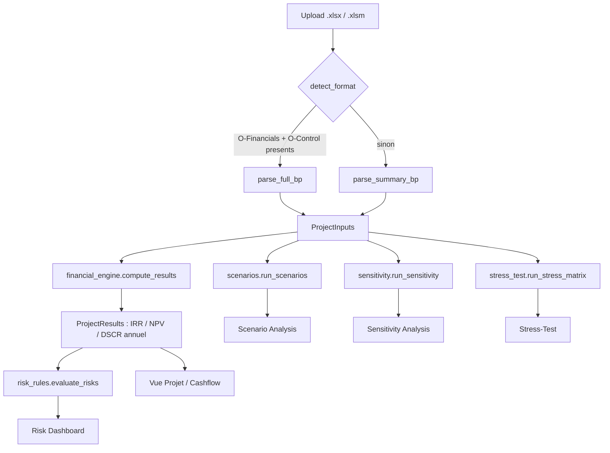

# Bankability_Project — Outil de bancabilite BESS

Application Streamlit qui lit le Business Plan Excel d'un projet de stockage batterie (BESS)
et restitue les analyses de bancabilite standard attendues par les preteurs : cashflow annuel,
scenarios Bear/Base/Bull, sensibilite one-way (tornado), matrice de stress-test, et dashboard de
risques a seuils. Suit la methodologie decrite dans l'article de reference sur les templates de
bancabilite BESS (revenue stacking, degradation, stress-test matrix, sensibilites, risk layer).

## Commandes

```bash
# Lancer l'application
py -m streamlit run app.py

# Suite de tests
py -m pytest tests/ -q

# Linting et formatage
py -m ruff check core/ ui/ tests/ app.py --fix
py -m black --line-length 100 core/ ui/ tests/ app.py

# Regenerer le fixture de test (format resume illustratif)
py sample_data/build_sample_xlsx.py
```

## Architecture



Modules (`core/`) :

| Module | Role |
|---|---|
| `models.py` | Dataclasses pivot : `ProjectInputs`, `YearlyResult`, `ProjectResults` |
| `bp_parser.py` | Lecture Excel -> `ProjectInputs` (2 formats, detection automatique) |
| `financial_engine.py` | IRR / NPV / dette a gearing fixe / DSCR annuel |
| `degradation.py` | Courbes de degradation additionnelle (Base / Conservative) |
| `scenarios.py` | Scenarios Bear (P10) / Base (P50) / Bull (P90) |
| `sensitivity.py` | Sensibilite one-way (tornado) ±10%/±20% |
| `stress_test.py` | Matrice de stress combine (revenu x degradation) |
| `risk_rules.py` | Regles de seuils -> flags rouge/orange/vert |

Configuration (`config/`) :

- `bp_mapping.yaml` — mapping libelle -> emplacement pour le format resume (1 onglet)
- `bp_mapping_full.yaml` — mapping libelle -> emplacement pour le format complet
  (`O-Financials` + `O-Control`)
- `risk_thresholds.yaml` — seuils du dashboard de risques (DSCR, hurdle rate, marge WACC)

Chaque feature ci-dessus a sa spec retrospective dans `docs/specs/` (objectif, decisions,
bugs corriges, questions ouvertes) — a lire avant de modifier un module.

## Conventions de signe (a ne jamais casser)

Les series annuelles de `ProjectInputs` portent **leur propre signe**, tel qu'exporte par le BP
source :

- `revenues_keur`, `end_of_life_keur` : **positifs** (entrees de cash)
- `capex_keur`, `opex_keur`, `turpe_keur` : **negatifs** (sorties de cash)

Consequence directe : le CFADS est une **simple somme** (`revenue + opex + turpe + end_of_life`),
jamais une soustraction. Deux bugs de signe (CFADS et part CAPEX financee par l'equity) ont ete
introduits puis corriges pendant l'implementation initiale — voir `docs/specs/financial_engine.md`
pour le detail, et `tests/test_financial_engine.py` pour les regressions correspondantes.

Les champs scalaires "hypotheses" (ex. `capex_initial_keur`) sont en revanche des **magnitudes
positives** (valeurs d'info, pas des flux de cashflow) — ne pas les confondre avec les series.

## Formats de BP supportes

**Format resume** (1 onglet, cashflows deja agreges par annee) : parsing par recherche de
libelle (pas de position de cellule fixe), voir `docs/specs/bp_parsing.md`.

**Format complet** (classeur reel multi-onglets, `O-Financials` + `O-Control`) : detection
automatique via `bp_parser.detect_format`. Les hypotheses de financement (gearing, taux,
maturite) sont extraites directement du BP quand ce format est utilise, plutot que de retomber
sur des valeurs par defaut generiques.

## Limites connues

- **Dette a gearing fixe, pas de dette sculptee** : le moteur financier utilise une annuite
  constante, pas le vrai echeancier de dette senior (DSRA, commitment fees, cash sweep) que
  contient le format complet. Le DSCR "reel" du BP (`ProjectInputs.reported_dscr_avg/min`) est
  affiche cote a cote avec le DSCR recalcule pour comparaison, jamais masque.
- **Detail des revenus par flux de marche non implemente** (DAM spread, ID spread, cycles,
  prix de capacite isoles) : necessiterait de resoudre la selection de la cle `configuration`
  dans l'onglet `Annual cashflows 1 MW` du classeur complet — voir `docs/specs/bp_parsing.md`,
  section "Questions ouvertes". Les sensibilites correspondantes sont explicitement marquees
  "non disponibles" dans l'UI plutot que simulees.
- **Ecart NPV** (format resume) : le NPV recalcule ne correspond pas exactement au NPV du BP
  source (IRR, lui, correspond quasi exactement) — hypothese non confirmee de convention de
  taux (reel vs nominal) differente.

## Donnees confidentielles

Les vrais Business Plans (`.xlsm`) et le dossier `fichier_excel/` a la racine du repo sont
exclus de git (`.gitignore`). Seul le fixture illustratif fabrique
(`sample_data/260612_BP_Stockage_Standalone__Claude.xlsx`) est commite, pour que les tests
tournent sans donnee reelle.
