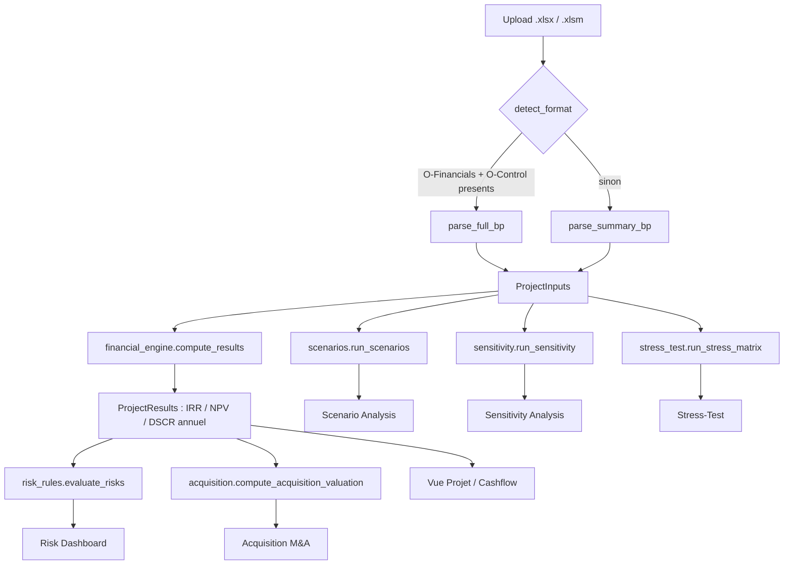

# Bankability_Project — Outil de bancabilite BESS

Application Streamlit qui lit le Business Plan Excel d'un projet de stockage batterie (BESS)
et restitue les analyses de bancabilite standard attendues par les preteurs. Suit la structure
en six couches decrite dans l'article de reference
[« How we built a BESS bankability template »](https://tudorionutgrigore.substack.com/p/how-we-built-a-bess-bankability-template)
(Tudor Ionut Grigore) : revenue stack modelling, degradation/availability, bear case stress
testing, sensitivity architecture, risk assessment layer, dashboard layer.

**Travail en cours (v2)** : extension multi-projets pilotee par les Business Cases Aurora
(`AU_Store`, strategies dev&sell RtB / garder&exploiter / racheter&flip). Vocabulaire et
decisions de conception dans `CONTEXT.md` et `docs/adr/`, methodologie complete (pre-
implementation) dans `docs/specs/aur_v2_methodology.md` — a lire avant de reprendre ce
chantier, que ce soit pour continuer le cadrage ou pour coder une phase.

## Installation

Toujours depuis `bankability_app/` (pas la racine du repo) :

```bash
py -m venv .venv
.venv\Scripts\python.exe -m pip install -r requirements.txt
.venv\Scripts\python.exe -m pip install pytest pytest-cov ruff black   # outils dev/test, optionnels pour juste lancer l'app
```

## Commandes

**Sans activer le venv** (fonctionne toujours, y compris si PowerShell bloque les scripts
`.ps1` non signes — erreur "l'execution de scripts est desactivee sur ce systeme") : prefixer
chaque commande par `.venv\Scripts\python.exe -m`.

```bash
.venv\Scripts\python.exe -m streamlit run app.py
.venv\Scripts\python.exe -m pytest tests/ -q
.venv\Scripts\python.exe -m ruff check core/ ui/ tests/ app.py --fix
.venv\Scripts\python.exe -m black --line-length 100 core/ ui/ tests/ app.py
.venv\Scripts\python.exe sample_data/build_sample_xlsx.py
```

**En activant le venv** (invite de commande prefixee par `(.venv)`, commandes plus courtes
ensuite) — necessite que l'execution de scripts PowerShell soit autorisee :

```powershell
# Une seule fois par utilisateur, si l'activation echoue avec une erreur de execution policy
Set-ExecutionPolicy -ExecutionPolicy RemoteSigned -Scope CurrentUser

.venv\Scripts\activate       # PowerShell/cmd, Windows
source .venv/bin/activate    # macOS / Linux

streamlit run app.py
pytest tests/ -q
ruff check core/ ui/ tests/ app.py --fix
black --line-length 100 core/ ui/ tests/ app.py
python sample_data/build_sample_xlsx.py
```

Sans activer le venv, prefixer chaque commande par le chemin de son python
(`.venv\Scripts\python.exe -m streamlit run app.py` sur Windows).

## Methodologie et provenance des donnees dans le BP

L'app supporte deux formats de classeur Excel, detectes automatiquement
(`bp_parser.detect_format`) :

- **Format resume** — un seul onglet, cashflows deja agreges par annee. Mapping :
  `config/bp_mapping.yaml`. Illustre par `sample_data/260612_BP_Stockage_Standalone__Claude.xlsx`
  (genere par `sample_data/build_sample_xlsx.py`).
- **Format complet** — classeur reel multi-onglets, reconnu a la presence des onglets
  `O-Financials` (P&L + cashflows annuels) et `O-Control` (hypotheses + resultats deja calcules).
  Illustre par `sample_data/160926_BP_Stockage_Standalone__.xlsx` (donnees fictives, inclut aussi
  les onglets du cas de developpement : `Inputs Dev`, `COPEX_library`, `CF Aurora`).
  Un 3e onglet, `I-Project` (hypotheses source les plus detaillees : CAPEX poste par poste,
  termes de financement complets, dette de repowering separee), est lu s'il est present -
  tolere s'il est absent. Mapping : `config/bp_mapping_full.yaml`.

Dans les deux cas, le parsing se fait **par recherche de libelle** dans la grille de cellules
(pas par adresse de cellule fixe) — voir `docs/specs/bp_parsing.md` pour le detail de cette
decision. Ci-dessous, pour chacune des six couches de l'article, ce que l'app implemente et
**precisement d'ou vient chaque donnee dans le BP**.

### Extension hors 6 couches, en amont : Cas de développement

Pas une des six couches de l'article — un point d'entrée **avant** elles : au lieu de lire un
BP déjà chiffré (les couches ci-dessous supposent un `O-Financials` déjà calculé), l'onglet
"Cas de développement" construit un `ProjectInputs` synthétique à partir d'hypothèses de
développement (année de COD, puissance, durée BESS, segment réseau, type TURPE, gabarit, mode
de CAPEX de raccordement) — sur le modèle de l'onglet `Advise Dev` du classeur réel. Détecté
automatiquement sur le **même fichier uploadé** (pas de 2e import) dès que les onglets
`Inputs Dev`, `COPEX_library` et `CF Aurora` sont présents ; apparaît comme 1er onglet de
l'app si c'est le cas.

Implémenté (`core/dev_case.py`, `core/dev_case_parser.py`) : le revenu est lu dans `CF Aurora`
(bibliothèque de 30 configurations — 3 classes de tension x 5 variantes TURPE/gabarit x 2
durées —, détail par flux normalisé 1 MW, indexé par année calendaire) ; le CAPEX/OPEX dans la
table "CAPEX/OPEX assumptions - AURORA" de `COPEX_library` (même taxonomie classe de
tension/durée, en €/kW) — validé **exactement** contre le fichier réel (CAPEX total = 21 536 k€
pour 40 MW en HTB1/2h, identique à la colonne "Aurora (k€)" d'`Advise Dev`). Une fois le cas de
base construit, `financial_engine.compute_results()` et tous les onglets existants s'appliquent
sans modification — une case "Analyse bancabilité complète" les active sur ce cas de base.

Leviers structurels balayables (chacun reconstruit un `ProjectInputs` complet par valeur, pas
un simple choc multiplicatif comme la couche 4) : distance de raccordement RTE, durée BESS
(2h/4h), configuration segment/TURPE/gabarit/repowering, année de COD. Revenu et CAPEX sont
tous deux validés à l'euro/k€ près contre le fichier réel. Le CAPEX/OPEX est en plus escaladé
par année de COD (poste par poste) via le "Forecast price factor" de `COPEX_library`, plafonné
sur la dernière année couverte (2034) au-delà. Voir `docs/specs/dev_case.md` pour le détail des
formules reproduites (coût de raccordement par distance, mapping segment CAPEX ↔ classe de
tension revenu, escalade par année de COD) et la limite connue restante (sur 20 ans, le revenu
Aurora décline pendant que l'OPEX reste plat, ce qui peut rendre l'IRR non calculable en fin de
période — à trancher au cas par cas selon la configuration testée).

### 1. Revenue Stack Modelling

Article : *"DAM/ID arbitrage, ancillary services (FCR, aFRR, mFRR), capacity payments, balancing
market participation"*, plus les overlays contractuels (CfD, tolling, PPA avec floor).

Implemente : le total des revenus annuels, utilise tel quel par le moteur financier.

| Donnee | Format resume | Format complet |
|---|---|---|
| Revenus annuels (total) | ligne `Revenues` (onglet unique) | ligne `Revenues` de `O-Financials` |
| Detail contracte (PPA + Capacite) vs merchant | non disponible | sous-lignes `PPA Revenues` + `Capacity market` (contracte) et `Merchant revenues (net of energy costs)` (merchant) de `O-Financials`, dans `ProjectInputs.revenue_detail`. Consomme par le Risk Dashboard (couche 5) pour ponderer le seuil DSCR par qualite de revenu — pas encore par le moteur financier (IRR/CFADS restent sur le total) |
| Detail par flux (DA, ID, aFRR, FCR isoles) | non disponible | **non implemente** — existe dans l'onglet `Annual cashflows 1 MW` (lignes `wholesale_storage_*`, `intraday_revenue`, `afrr_*`, `fcr_revenue`), mais la cle `configuration` a utiliser pour un projet donne (fonction de `Type TURPE` + duree + segment, definis dans `I-Project`) n'est pas encore fiabilisee — voir `docs/specs/bp_parsing.md`, "Questions ouvertes" |

### 2. Degradation and Availability

Article : courbes de fade de capacite calibrees sur la chimie/cyclage (pas les specs
constructeur), cas base et conservative, disponibilite liee aux termes du contrat O&M.

Implemente : `core/degradation.py` — une courbe de degradation **additionnelle**, appliquee
par-dessus la serie de revenus du BP (qui encode deja implicitement sa propre hypothese de
degradation/baisse de prix). **Pas extraite du BP** : valeurs par defaut (Base -2%/-0.5% par an,
Conservative -3%/-1% par an), editables dans `config/` ou en argument de
`degradation_multipliers()`. La disponibilite liee au contrat O&M n'est pas modelisee.

### 3. Bear Case Stress Testing

Article : matrice testant le bear case revenu, la degradation, et le combine, pour reperer les
points de rupture du modele.

Implemente : `core/stress_test.py` — grille `{Base, Bear} x {degradation Base, Conservative}`
(4 cellules), chacune recalculee via `financial_engine.compute_results`. Le "Bear" applique un
multiplicateur de -15% sur les revenus extraits du BP (voir couche 1) ; la degradation est celle
de la couche 2 (non extraite du BP).

### 4. Sensitivity Architecture

Article : *"20 to 30 pre-built scenarios"* sur les variables que les preteurs challengent :
compression du capture rate, changements reglementaires, depassements de CAPEX, chocs de taux,
curtailment reseau.

Implemente : `core/sensitivity.py` — 5 variables x 5 chocs (±10%/±20%) = 25 scenarios : Revenue
Total, CAPEX, OPEX, Interest Rate, Debt Ratio. CAPEX/OPEX/Revenue viennent des series du BP
(couche 1 et CAPEX/OPEX, voir tableau ci-dessous) ; Interest Rate et Debt Ratio partent des
hypotheses de financement (voir couche 5bis). Les variables de marche isolees (DAM Spread, ID
Spread, Cycles, Capacity Price) listees par l'article ne sont pas encore actives, meme
limitation que le detail par flux de la couche 1.

| Donnee | Format resume | Format complet |
|---|---|---|
| CAPEX (total) | ligne `CAPEX` (onglet unique) | ligne `CAPEX (w/o DSRA and financing fees)` de `O-Financials` |
| CAPEX (recoupement) | — | libelle `CAPEX (w/o DSRA and financing fees)` de `I-Project` (offset 2 — voir piege libelle/unite/valeur ci-dessous). Un ecart d'~1000 k€ avec la valeur ci-dessus a ete observe sur un projet reel, non explique — les deux valeurs sont affichees cote a cote (`docs/specs/bp_parsing.md`) |
| OPEX (total) | ligne `OPEX (live = C-SPV)` | ligne `Operating Costs` de `O-Financials` |
| TURPE / taxes d'exploitation | ligne `TURPE (variable + fixe)` | ligne `Operating Taxes` de `O-Financials` (regroupe TURPE + IFER/TFPB/CFE/CVAE) |

### 5. Risk Assessment Layer

Article : *"Embedded commentary inside the model, triggering when certain median/minimum
thresholds are not met"*, avec severite, envoye a la couche Dashboard.

Implemente : `core/risk_rules.py` + `config/risk_thresholds.yaml` — 3 regles (DSCR min, Equity
IRR vs hurdle rate, Project IRR vs WACC), chacune produisant un flag rouge/orange/vert. Les
metriques evaluees (DSCR, IRR) sont calculees par `financial_engine.py` a partir des donnees BP
(couches 1 et 5bis).

Le seuil DSCR "confortable" (palier orange/vert) n'est pas une simple constante : par ordre de
priorite, l'app utilise (1) le covenant reel du projet (`Target DSCR` d'`I-Project`) si present,
(2) sinon un seuil **pondere par le mix de revenu contracte/merchant** (`dscr_min_amber_contracted`
1.30x / `dscr_min_amber_merchant` 1.50x de `config/risk_thresholds.yaml`, ponderes par la part de
chaque type de revenu dans `revenue_detail` — couche 1) — un euro de revenu merchant n'a pas la
meme valeur bancaire qu'un euro de revenu contracte, donc un projet tres merchant est tenu a un
DSCR plus exigeant, (3) sinon le seuil generique `dscr_min_amber` (1.30x). Le seuil "critique"
(`dscr_min_red`, 1.10x) reste toujours generique. Le message de chaque flag precise la source du
seuil applique.

**5bis. Hypotheses de financement** (non nommee explicitement dans l'article, mais necessaire
pour DSCR/Equity IRR) :

| Donnee | Format resume | Format complet |
|---|---|---|
| Gearing (% dette, tranche initiale) | non disponible (defaut UI 70%) | 2e valeur non-vide apres le libelle `Debt` de `O-Control` |
| Taux d'interet (tranche initiale) | non disponible (defaut UI 5%) | libelle `All-in rate (fixed part)` de `O-Control` |
| Maturite de la dette (tranche initiale) | non disponible (defaut UI 15 ans) | libelle `Maturity` de `O-Control` |
| WACC | libelle `WACC` (onglet unique, si present) | absent du BP — approxime par un blend `gearing x taux dette + (1-gearing) x "Equity discount factor"` (voir `docs/specs/bp_parsing.md`) |
| DSCR cible du projet (covenant) | non disponible | libelle `Target DSCR - Period 1` de `I-Project` (offset 2) — voir ci-dessous |
| Gearing / taux / maturite (tranche repowering) | non disponible (defauts UI 70%/5%/10 ans) | section "BESS Repowering debt" de `I-Project` : libelles `Gearing`, `All-in rate (fixed part)` (occurrence 2), `Maturity` (occurrence 2), tous offset 2 |
| Frais upfront de la dette senior | non disponible | libelle `Senior Debt Upfront fee` de `I-Project` (offset 2) — utilise uniquement en mode "Dimensionne par DSCR" |
| Additions au CAPEX pour le gearing (DSRA, frais de financement construction, couts d'operation construction, cash minimum) | non disponible | bloc "Uses & Sources" de `O-Control` : libelles `DSRA`, `Financing costs, fees and interests during construction`, `Operation costs during construction`, `Minimum cash at hands` — utilise uniquement en mode "Gearing fixe" (voir ci-dessous) |

La dette de repowering est une **2e tranche independante** de la dette initiale (voir
`docs/specs/financial_engine.md`) : detectee automatiquement comme la 2e sortie de CAPEX dans
la serie annuelle (`capex_keur`), avec son propre gearing/taux/tenor. Sans 2e sortie de CAPEX
dans la serie, cette tranche reste a 0 quel que soit le contenu d'`I-Project` (ex. Belle Epine a
des termes de dette repowering definis dans `I-Project` mais `Repowering: Non` dans sa serie
CAPEX — la tranche repowering ne s'active donc pas).

**Deux modes de dimensionnement de la dette**, basculables dans la sidebar (`debt_sizing_mode`) :
- **Gearing fixe** (defaut) : `Debt = gearing_pct x (CAPEX + additions "Uses & Sources" de
  O-Control quand disponibles)`, annuite constante, le DSCR est un resultat. Le vrai gearing
  s'applique au `Total Uses` (CAPEX + DSRA + frais de financement construction + cash minimum),
  pas au CAPEX seul — trouvaille de validation sur Belle Epine, ou l'ecart avec la dette reelle
  passe de ~8% (CAPEX seul) a un match quasi-exact une fois ces additions incluses. Sans elles
  (format resume, ou colonnes absentes du classeur), se rabat sur `gearing_pct x CAPEX`, comme
  avant.
- **Dimensionne par DSCR** (visible seulement si `Target DSCR` est extrait d'`I-Project`) : la
  dette est **sculptee** — `service_annee = CFADS_annee / Target DSCR` **chaque annee** (pas
  juste dans la pire), en forme fermee (pas d'iteration necessaire malgre le fait que le BP
  source resout le meme probleme par une macro VBA a iteration circulaire). Le principal est
  plafonne par `gearing x (CAPEX + interets intercalaires capitalises + frais upfront de la
  dette senior)` plutot que juste `gearing x CAPEX`. Le gearing devient alors un plafond, pas un
  montant impose. **N'egale pas pour autant le DSCR reel rapporte dans le BP** (DSRA, commitment
  fees et cash sweep restent non modelises) : voir `docs/specs/financial_engine.md`, "Questions
  ouvertes", pour le detail (la dette reelle a par ailleurs ete dimensionnee une fois, a la
  cloture financiere, sur un cas de revenus potentiellement different de la serie actuelle).

### 6. Dashboard Layer

Implemente : les onglets Streamlit (`app.py` + `ui/*.py`) — Vue Projet, Cashflow, Scenario
Analysis, Sensitivity Analysis, Stress-Test, Risk Dashboard — chacun affichant les flags/valeurs
produits par les couches precedentes, avec pour chaque metrique cle la valeur recalculee **et**
la valeur deja presente dans le BP source quand elle existe (`ProjectInputs.reported_*`), pour
comparaison directe plutot que remplacement silencieux.

### Extension hors 6 couches : Acquisition (M&A)

Pas une des six couches de l'article, mais une reformulation de la meme sortie (le moteur
financier) pour une question differente : *combien peut-on payer pour acquerir ce projet (SPV)
plutot que de le developper en interne, tout en tenant un rendement equity cible ?* Onglet
"Acquisition (M&A)", derriere une case a cocher (`ui/acquisition_tab.py`).

Implemente (`core/acquisition.py`) : la prime d'acquisition maximale n'est jamais une
hypothese — elle se resout comme `NPV(rendement cible, serie de cashflows equity)`, qui equivaut
a `PV(flux equity futurs @ rendement cible) - Equity de base requis`. Reutilise directement
`ProjectResults.equity_amount_keur` et `YearlyResult.equity_cashflow_keur` deja calcules par la
couche 5bis — aucune nouvelle donnee BP necessaire. Sensibilite de cette prime sur les 5 memes
variables que la couche 4 (Revenue, CAPEX, OPEX, Interest Rate, Debt Ratio — OPEX sert de proxy
au "grid cost" de la methode source, qui n'a pas d'equivalent isole dans ce modele). Complete
par une table de reperes de marche par stade de developpement (droits de developpement, RTB,
actifs en exploitation) — purement informative, jamais utilisee dans le calcul. Voir
`docs/specs/acquisition_valuation.md` pour la formule detaillee et sa source.

### Hypotheses techniques / projet (hors 6 couches)

| Donnee | Format resume | Format complet |
|---|---|---|
| Nom du projet | libelle `Name` | libelle `Name` de `O-Control` |
| Localisation | libelle `Location city` | libelle `Location city` de `O-Control` |
| Segment tarifaire | libelle `Segment` | libelle `Segment` de `O-Control` |
| Date de mise en service (COD) | libelle `BESS commercial operation date (COD)` | idem, dans `O-Control` |
| Duree d'exploitation | libelle `BESS operating time` | idem, dans `O-Control` |
| Puissance utile | libelle `BESS Usable Power` | libelle `ESS Usable Power @PoC (AC)` de `O-Control` |
| Energie utile | libelle `BESS Usable Energy` | libelle `ESS Usable Energy @PoC BoL (AC)` de `O-Control` |
| IRR / NPV / DSCR deja calcules dans le BP | libelles `IRR`, `WACC`, `NPV` | libelles `IRR` (+ 2e valeur = Equity IRR), `NPV`, `Average DSCR`, `Min. DSCR` de `O-Control` |

## Architecture



Modules (`core/`) :

| Module | Role | Couche(s) de la methodologie |
|---|---|---|
| `models.py` | Dataclasses pivot : `ProjectInputs`, `YearlyResult`, `ProjectResults` | — |
| `bp_parser.py` | Lecture Excel -> `ProjectInputs` (2 formats, detection automatique, `I-Project` optionnel) | 1, 5bis, techniques |
| `financial_engine.py` | IRR / NPV / dette a 2 tranches (initiale + repowering), 2 modes de dimensionnement (gearing fixe ou DSCR-sculpte) / DSCR annuel | 1, 5bis |
| `degradation.py` | Courbes de degradation additionnelle (Base / Conservative) | 2 |
| `scenarios.py` | Scenarios Bear (P10) / Base (P50) / Bull (P90) | 3 (variante) |
| `sensitivity.py` | Sensibilite one-way (tornado) ±10%/±20% | 4 |
| `stress_test.py` | Matrice de stress combine (revenu x degradation) | 3 |
| `risk_rules.py` | Regles de seuils -> flags rouge/orange/vert | 5 |
| `acquisition.py` | Prime d'acquisition maximale (M&A) + sensibilite | extension hors 6 couches |
| `dev_case.py` / `dev_case_parser.py` | Construit un `ProjectInputs` depuis des hypotheses de developpement (COD, puissance, duree, segment, TURPE) + bibliotheques CAPEX/revenu (`COPEX_library`/`CF Aurora`) | extension hors 6 couches, en amont |
| `copex_icp.py` | CAPEX/OPEX BESS depuis `config/copex_icp.xlsx` (couts unitaires QEF reels, "ICP", mis a jour mensuellement) - source primaire pour le moteur Aurora v2, Aurora `COPEX_library` en repli pour les postes non couverts (Development, Insurance/Grid charges/Land lease/Accise/Other, HTB3) | 5bis (CAPEX/OPEX du moteur Aurora v2) |

Configuration (`config/`) :

- `bp_mapping.yaml` — mapping libelle -> emplacement pour le format resume (1 onglet)
- `bp_mapping_full.yaml` — mapping libelle -> emplacement pour le format complet
  (`O-Financials` + `O-Control` + `I-Project` optionnel)
- `risk_thresholds.yaml` — seuils du dashboard de risques (DSCR generique + pondere par mix de
  revenu, hurdle rate, marge WACC)
- `copex_icp.xlsx` — couts unitaires CAPEX/OPEX BESS reels ("ICP"), source primaire du moteur
  Aurora v2 depuis le 2026-09-24 — a remplacer (meme nom de fichier) a chaque mise a jour mensuelle,
  voir `docs/specs/copex_icp.md`

Chaque module ci-dessus a sa spec retrospective dans `docs/specs/` (objectif, decisions,
bugs corriges, questions ouvertes) — a lire avant de le modifier.

## Conventions de signe (a ne jamais casser)

Les series annuelles de `ProjectInputs` portent **leur propre signe**, tel qu'exporte par le BP
source :

- `revenues_keur`, `end_of_life_keur` : **positifs** (entrees de cash)
- `capex_keur`, `opex_keur`, `turpe_keur` : **negatifs** (sorties de cash)

Consequence directe : le CFADS est une **simple somme** (`revenue + opex + turpe + end_of_life`),
jamais une soustraction. Deux bugs de signe (CFADS et part CAPEX financee par l'equity) ont ete
introduits puis corriges pendant l'implementation initiale — voir `docs/specs/financial_engine.md`
pour le detail, et `tests/test_financial_engine.py` pour les regressions correspondantes.

Les champs scalaires "hypotheses" (ex. `capex_initial_keur`) sont en revanche des **magnitudes
positives** (valeurs d'info, pas des flux de cashflow) — ne pas les confondre avec les series.

## Limites connues

- **Pas de vrai echeancier de dette senior, meme en mode "dimensionne par DSCR"** (voir couche
  5bis) : ce mode sculpte le remboursement (variable par annee, formule fermee) et tient compte
  des interets intercalaires capitalises et des frais upfront de la dette senior, mais pas de
  DSRA (en tant que facility separee), de commitment fees, ni de cash sweep — que la vraie macro
  de dimensionnement du BP source (VBA, resolue par iteration circulaire) prend en compte. Le
  DSCR "reel" du BP (`ProjectInputs.reported_dscr_avg/min`) est affiche cote a cote avec le DSCR
  recalcule pour comparaison, jamais masque. Le mode "dimensionne par DSCR" **rapproche** les
  chiffres de la realite sans les reproduire exactement — la dette reelle du BP a par ailleurs
  ete dimensionnee une seule fois, a la cloture financiere, potentiellement sur un cas de
  revenus different de la serie actuelle du fichier charge (voir
  `docs/specs/financial_engine.md`, "Questions ouvertes").
- **Detail des revenus par flux de marche non implemente** — voir couche 1 ci-dessus et
  `docs/specs/bp_parsing.md`, section "Questions ouvertes".
- **Ecart NPV** (format resume) : le NPV recalcule ne correspond pas exactement au NPV du BP
  source (IRR, lui, correspond quasi exactement) — hypothese non confirmee de convention de
  taux (reel vs nominal) differente.
- **Ecart CAPEX entre `O-Control` et `I-Project`** (~1000 k€ sur un projet reel observe) — voir
  couche 4 ci-dessus et `docs/specs/bp_parsing.md`, section "Questions ouvertes".
- **Moteur Aurora v2 (`core/aur_cases.py`, Configurateur/Analyse globale) : valeur residuelle de
  fin de vie non modelisee.** `AU_Store!EoL_perkW` (118,44 EUR/kW) est charge mais jamais applique
  dans `build_project_inputs` — `end_of_life_keur` reste une serie de zeros, ce qui sous-estime
  legerement le rendement des projets longs. Le cout de repowering (2e sortie CAPEX a l'op-year
  15), lui, est modelise depuis le 2026-09-18 (Battery system + Inverter, source `copex_icp.xlsx`
  depuis le 2026-09-24 — voir `docs/specs/copex_icp.md`).
- **CAPEX/OPEX du moteur Aurora v2 : poste "OPEX Guarantees & preventive maint" (ICP, cout total
  15 ans) etale comme addition constante a l'OPEX annuel**, pas limite aux 15 premieres annees
  (le moteur financier n'a pas de notion d'OPEX variable dans le temps) — voir
  `docs/specs/copex_icp.md`, "Questions ouvertes".

## Donnees confidentielles

Les vrais Business Plans (`.xlsm`) et le dossier `fichier_excel/` a la racine du repo sont
exclus de git (`.gitignore`). Seuls les fixtures illustratifs fabriques
(`sample_data/260612_BP_Stockage_Standalone__Claude.xlsx` pour le format resume,
`sample_data/160926_BP_Stockage_Standalone__.xlsx` pour le format complet) sont commites, pour
que les tests tournent sans donnee reelle. Le fixture format complet est converti en `.xlsx`
(valeurs figees, sans macro) avant d'etre commite, pour ne pas etre bloque par la regle
`.gitignore` `*.xlsm` qui protege les vrais BP.

`config/copex_icp.xlsx` (couts unitaires CAPEX/OPEX BESS reels QEF) est, lui, committe
deliberement (choix de l'utilisateur, 2026-09-24) — a la difference des BP projet, ce ne sont pas
des donnees clients/projet mais des hypotheses de couts internes, mises a jour mensuellement en
remplacant ce fichier.
